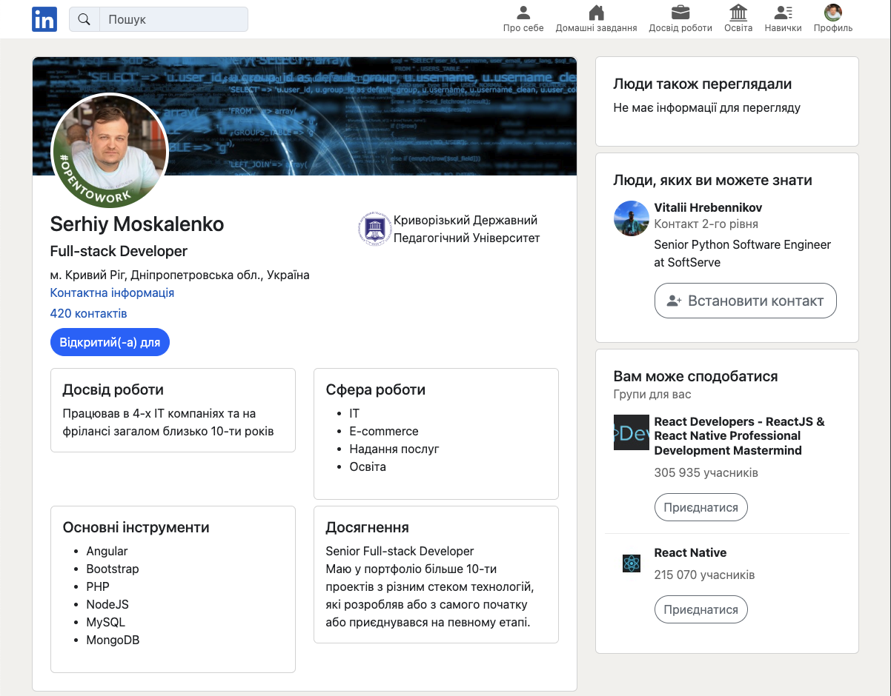
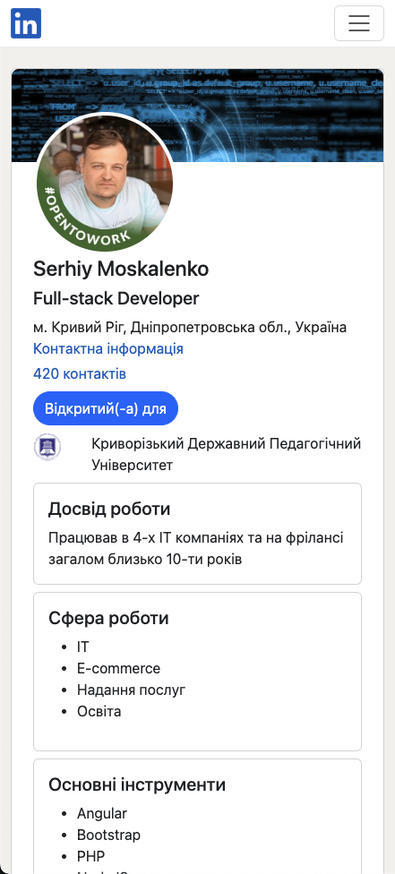

### Tasks:
1. Using HTML, CSS, Bootstrap, create an HTML page with knowledge about yourself. The information should print the following elements:
   - Name
   - (Optional) Photo
   - Brief information "About yourself": work experience, field, achievements
   - A list of completed homework assignments and grades for them in the form of a table
   - Work experience starting from the last place:
     - The company name
     - Period of work
     - The main duties and technologies with which it was necessary to work
     - Main achievements

2. (optional) Make the page responsive to different screen sizes.

3. (optional) Make a page displayed on your LinkedIn profile.

### Results:
- desktop version
 

- mobile version
 
